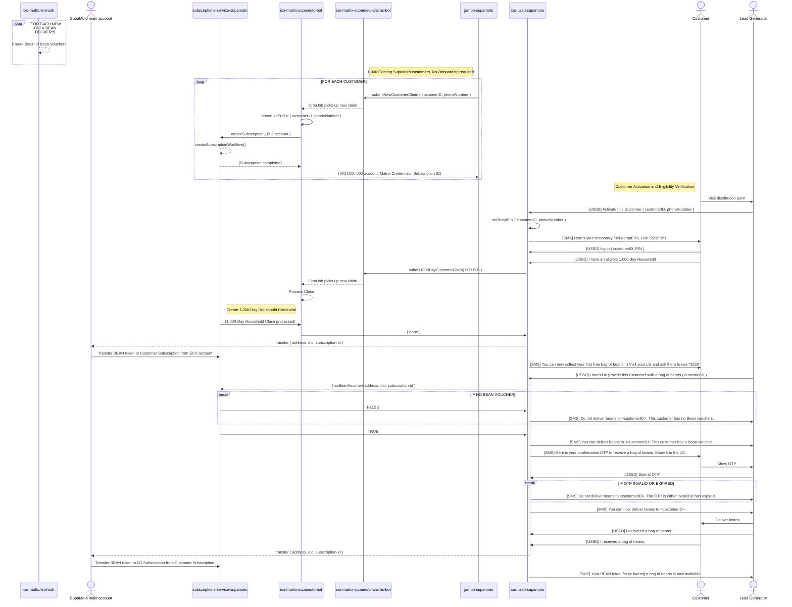

```mermaid
sequenceDiagram
  participant ixo-multiclient-sdk as ixo-multiclient-sdk
  actor SUPA as SupaMoto main account
  participant subscriptions-service-supamoto as subscriptions-service-supamoto
  participant ixo-matrix-supamoto-bot as ixo-matrix-supamoto-bot
  participant ixo-matrix-supamoto-claims-bot as ixo-matrix-supamoto-claims-bot
  participant jambo-supamoto as jambo-supamoto
  participant ixo-ussd-supamoto as ixo-ussd-supamoto
  actor Customer as Customer
  actor LG as Lead Generator
  loop FOR EACH NEW BULK BEAN DELIVERY
    ixo-multiclient-sdk-->>ixo-multiclient-sdk: Create Batch of Bean Vouchers
  end
  Note left of jambo-supamoto: 1,000 Existing SupaMoto customers. No Onboarding required.
  loop FOR EACH CUSTOMER
    jambo-supamoto->>ixo-matrix-supamoto-claims-bot: submitNewCustomerClaim ( customerID, phoneNumber )
    ixo-matrix-supamoto-claims-bot-->>ixo-matrix-supamoto-bot: CronJob picks up new claim
    ixo-matrix-supamoto-bot->>ixo-matrix-supamoto-bot: createIxoProfile ( customerID, phoneNumber )
    ixo-matrix-supamoto-bot->>subscriptions-service-supamoto: createSubscription ( IXO account )
    subscriptions-service-supamoto-->>subscriptions-service-supamoto: createSubscriptionWorkflow()
    subscriptions-service-supamoto-->>ixo-matrix-supamoto-bot: (Subscription completed)
    ixo-matrix-supamoto-bot-->>jambo-supamoto: (IXO DID, IXO account, Matrix Credentials, Subscription ID)
  end
  Note left of Customer: Customer Activation and Eligibility Verification
  Customer->>LG: Visit distribution point
  LG->>+ixo-ussd-supamoto: [USSD] Activate this Customer ( customerID, phoneNumber )
  ixo-ussd-supamoto->>ixo-ussd-supamoto: setTempPIN ( customerID, phoneNumber )
  ixo-ussd-supamoto->>Customer: [SMS] Here's your temporary PIN (tempPIN). Use *2233*2*1# to log in and reset your PIN. Ensure that you have your Customer ID available to log in.
  Customer->>ixo-ussd-supamoto: [USSD] log in ( customerID, PIN )
  Customer->>ixo-ussd-supamoto: [USSD] I have an eligible 1,000-day Household
  ixo-ussd-supamoto->>ixo-matrix-supamoto-claims-bot: submit1000DayCustomerClaim( IXO DID )
  ixo-matrix-supamoto-claims-bot-->>ixo-matrix-supamoto-bot: CronJob picks up new claim
  ixo-matrix-supamoto-bot-->>ixo-matrix-supamoto-bot: Process Claim
  Note left of ixo-matrix-supamoto-bot: Create 1,000-Day Household Credential
  subscriptions-service-supamoto->>ixo-matrix-supamoto-bot: (1,000-Day Household Claim processed)
  ixo-matrix-supamoto-bot->>ixo-ussd-supamoto: ( done )
  ixo-ussd-supamoto-->>SUPA: transfer ( address, did, subscription-id )
  SUPA->>subscriptions-service-supamoto: Transfer BEAN token to Customer Subscription from ECS account
  ixo-ussd-supamoto->>Customer: [SMS] You can now collect your first free bag of beans! :) Visit your LG and ask them to use *2233#3*2*2# to register their intent to deliver a bag of beans to you.
  LG->>+ixo-ussd-supamoto: [USSD] I intend to provide this Customer with a bag of beans ( customerID )
  ixo-ussd-supamoto->>subscriptions-service-supamoto: hasBeanVoucher( address, did, subscription-id )
  break IF NO BEAN VOUCHER
    subscriptions-service-supamoto->>ixo-ussd-supamoto: FALSE
    ixo-ussd-supamoto->>LG: [SMS] Do not deliver beans to <customerID>. This customer has no Bean vouchers.
  end
  subscriptions-service-supamoto->>ixo-ussd-supamoto: TRUE
  ixo-ussd-supamoto->>LG: [SMS] You can deliver beans to <customerID>. This customer has a Bean voucher.
  ixo-ussd-supamoto->>Customer: [SMS] Here is your confirmation OTP to receive a bag of beans. Show it to the LG.
  Customer->>LG: Show OTP
  LG->>ixo-ussd-supamoto: [USSD] Submit OTP
  break IF OTP INVALID OR EXPIRED
    ixo-ussd-supamoto->>LG: [SMS] Do not deliver beans to <customerID>. The OTP is either invalid or has expired.
  end
  ixo-ussd-supamoto->>LG: [SMS] You can now deliver beans to <customerID>.
  LG->>Customer: Deliver beans
  LG->>ixo-ussd-supamoto: [USSD] I delivered a bag of beans.
  Customer->>ixo-ussd-supamoto: [USSD] I received a bag of beans.
  ixo-ussd-supamoto-->>-SUPA: transfer ( address, did, subscription-id )
  SUPA->>subscriptions-service-supamoto: Transfer BEAN token to LG Subscription from Customer Subscription.
  ixo-ussd-supamoto->>LG: [SMS] Your BEAN token for delivering a bag of beans is now available.
```
