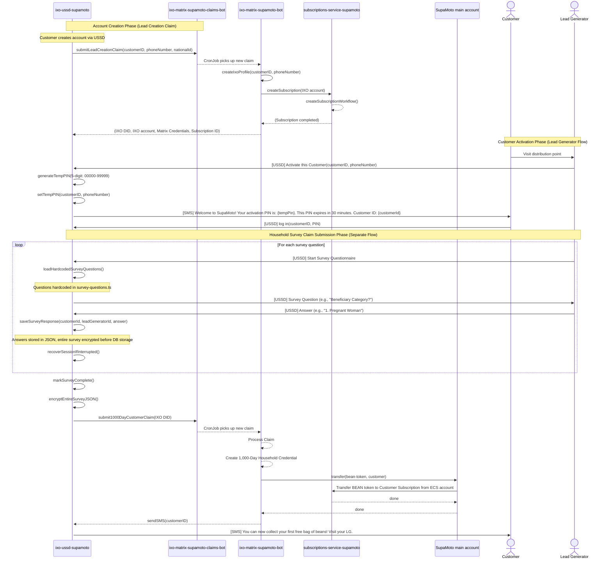
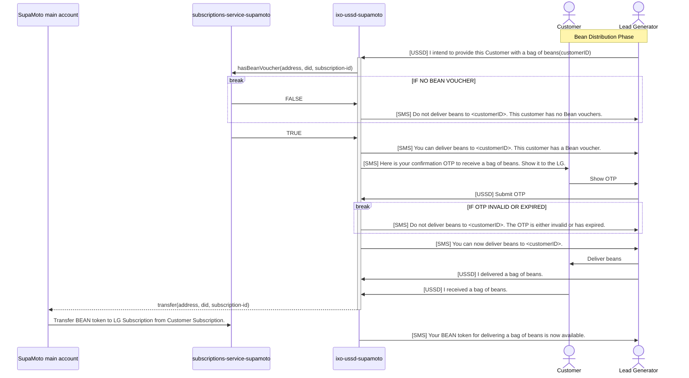
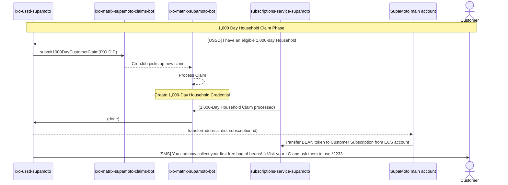
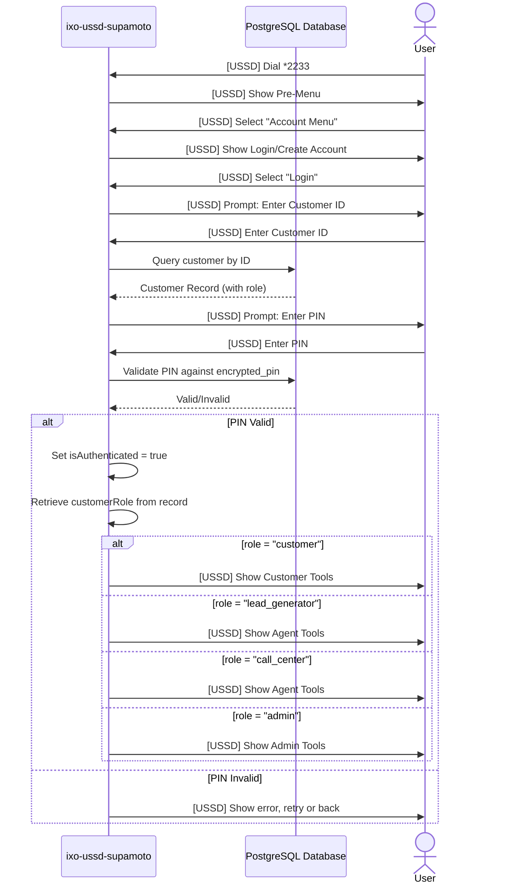

# SupaMoto Sequence Diagrams

This document provides detailed sequence diagrams for the key SupaMoto workflows, including customer activation, bean distribution, and role-based access control.

## 1. Customer Activation Flow

### Overview

Customer activation is a multi-phase process involving account creation with IXO profile setup, Lead Generator verification at distribution point, and customer self-activation via USSD.

### Implementation Status

- ✅ **Implemented**: Account creation, IXO profile creation, temporary PIN generation and SMS sending, customer activation
- 🚧 **Stubbed**: Claim submission in activation flow (actual claims submitted via separate survey flow)
- ✅ **Implemented**: 1,000 Day Household survey and claim submission (separate flow via `thousandDaySurveyMachine`)

### Sequence Diagram



### Key Steps

1. **Account Creation**: Customer creates account via USSD, triggering background IXO profile creation
2. **Lead Creation Claim**: USSD submits lead creation claim via `@ixo/supamoto-bot-sdk` during account creation
3. **IXO Profile Creation**: Matrix bot creates IXO profile and subscription
4. **LG Initiates Activation**: Lead Generator selects "Activate a Customer" from Agent Tools
5. **Temp PIN Generation**: System generates 5-digit temporary PIN (range: 00000-99999)
6. **SMS Sent**: Activation SMS sent to customer with temporary PIN and Customer ID
7. **Customer Logs In**: Customer dials USSD and logs in with temp PIN
8. **Survey Questions**: Lead Generator conducts survey using hardcoded questions from `survey-questions.ts`
9. **Session Recovery**: System checks for interrupted survey and resumes from last question
10. **Survey Answers**: LG enters customer's answers to household eligibility questions one at a time
11. **Survey Storage**: Answers stored in JSON structure, entire survey form encrypted before database persistence
12. **Survey Persistence**: Encrypted survey JSON saved to `household_claims.survey_form` (TEXT field) for session recovery
13. **Survey Completion**: All required questions answered, survey marked complete
14. **1,000 Day Household Claim**: System submits claim via `@ixo/supamoto-bot-sdk` (implemented in `thousandDaySurveyMachine`)
15. **Claim Processing**: Matrix bots process claim and create credential
16. **Token Transfer**: SUPA transfers BEAN token to customer subscription
17. **Confirmation**: Customer receives SMS confirming bean collection eligibility

### Database Operations

- **Insert**: New row in `customers` table during account creation
- **Update**: `customers.encrypted_pin` with bcrypt-encrypted 5-digit temporary PIN
- **Insert/Update**: `household_claims.survey_form` TEXT field with encrypted JSON survey data
  - **Note**: Stored as TEXT (not JSONB) because encryption prevents JSONB casting
  - **Structure**: `{formDefinition: {...}, answers: {...}, metadata: {...}}`
- **Update**: `household_claims.survey_form_updated_at` timestamp when survey updated
- **Insert**: `household_claims` table with claim data
- **Update**: `household_claims.claim_status` to "PROCESSED" after successful claim submission
- **Log**: Event logged in `audit_log` table with type "CUSTOMER_ACTIVATED"
- **Log**: Event logged in `audit_log` table with type "SURVEY_COMPLETED"

### External Systems Involved

- **ixo-matrix-supamoto-claims-bot**: Claims submission endpoint (HTTP API via `@ixo/supamoto-bot-sdk`)
- **ixo-matrix-supamoto-bot**: IXO profile and credential creation
- **subscriptions-service-supamoto**: Subscription and voucher management
- **SupaMoto main account (SUPA)**: Token transfer operations

### Implementation Notes

- **Lead Creation Claims**: Submitted during account creation via `background-ixo-creation.ts`, not via external jambo-supamoto system
- **Activation Flow Claim Submission**: The `submitClaimService` in `customerActivationMachine.ts` is currently **stubbed** (lines 264-295)
- **Actual Claim Submission**: 1,000 Day Household claims are submitted via the separate survey flow in `thousandDaySurveyMachine.ts` (lines 289-355)
- **SMS Template Discrepancy**: The actual SMS sent uses a simpler message than the template in `activation.ts` (see `sms.ts` line 343)

---

## 2. Bean Distribution Workflow

### Overview

Complete bean distribution process from LG intent registration through customer confirmation, including voucher verification and token transfers.

### Implementation Status

⚠️ **PARTIALLY IMPLEMENTED**: The bean distribution workflow has the following implementation status:

- ✅ **Database Schema**: All tables exist (`lg_delivery_intents`, `bean_distribution_otps`, `bean_delivery_confirmations`)
- ✅ **SMS Templates**: All SMS templates exist in `src/templates/sms/otp.ts` and `delivery.ts`
- ✅ **Database Services**: CRUD operations implemented in `database-storage.ts`
- 🚧 **USSD State Machine Flows**: Currently **STUBBED** in `userServicesMachine.ts` (lines 416-443):
  - `agentRegisterIntent`: "[Stub] Register Intent to Deliver Beans not yet implemented"
  - `agentSubmitOTP`: "[Stub] Submit Customer OTP not yet implemented"
  - `agentConfirmDelivery`: Stub implementation
- ⚠️ **Customer Confirmation**: Partially implemented in `customerToolsMachine.ts`

**Note**: The sequence diagram below represents the **intended design**, not the current implementation state.

### Sequence Diagram



### Key Steps

1. **Intent Registration**: LG registers intent to deliver beans to customer (🚧 Stubbed)
2. **Voucher Check**: USSD queries subscriptions-service for bean voucher status (🚧 Stubbed)
3. **No Voucher Path**: If customer has no voucher, SMS sent to LG with denial (🚧 Stubbed)
4. **Has Voucher Path**: If customer has voucher, SMS sent to LG confirming delivery eligibility (🚧 Stubbed)
5. **OTP Generation**: System generates 5-digit OTP (range: 00000-99999, valid 10 minutes) and sends to customer (🚧 Stubbed)
6. **OTP Display**: Customer shows OTP to LG (🚧 Stubbed)
7. **OTP Submission**: LG submits OTP via USSD (🚧 Stubbed)
8. **OTP Validation**: System validates OTP (not expired, not used) (🚧 Stubbed)
9. **Invalid OTP Path**: If OTP invalid/expired, SMS sent to LG with denial (🚧 Stubbed)
10. **Valid OTP Path**: If OTP valid, SMS sent to LG confirming delivery authorization (🚧 Stubbed)
11. **Physical Delivery**: LG delivers beans to customer (🚧 Stubbed)
12. **LG Confirmation**: LG confirms delivery via USSD (🚧 Stubbed)
13. **Customer Confirmation**: Customer confirms receipt via USSD (⚠️ Partially implemented)
14. **Token Transfer**: SUPA transfers BEAN token from customer to LG subscription (🚧 Stubbed)
15. **Completion**: LG receives SMS confirming token availability (🚧 Stubbed)

### Database Operations

- **Insert**: `lg_delivery_intents` (intent registration)
- **Insert**: `bean_distribution_otps` (OTP tracking)
- **Insert**: `bean_delivery_confirmations` (dual confirmations)
- **Update**: `bean_delivery_confirmations` (customer confirmation)
- **Log**: Events in `audit_log` table

### External Systems Involved

- **subscriptions-service-supamoto**: Voucher verification and token transfers
- **SupaMoto main account (SUPA)**: Token transfer operations
- **ixo-ussd-supamoto**: USSD interface and orchestration

### SMS Templates

- **Voucher Check Failure**: "Do not deliver beans to <customerID>. This customer has no Bean vouchers."
- **Voucher Check Success**: "You can deliver beans to <customerID>. This customer has a Bean voucher."
- **OTP SMS to Customer**: "Here is your confirmation OTP to receive a bag of beans. Show it to the LG."
- **OTP Invalid/Expired**: "Do not deliver beans to <customerID>. The OTP is either invalid or has expired."
- **OTP Valid**: "You can now deliver beans to <customerID>."
- **Token Transfer Confirmation**: "Your BEAN token for delivering a bag of beans is now available."

---

## 3. 1,000 Day Household Claim Flow

### Overview

Customer self-proclamation of 1,000 Day Household eligibility for bean voucher allocation, processed through Matrix bots and subscription service.

### Implementation Status

✅ **FULLY IMPLEMENTED**: This flow is implemented in `thousandDaySurveyMachine.ts` with complete survey, claim submission, and database persistence.

### Sequence Diagram



### Key Steps

1. **Survey Completion**: Lead Generator completes 1,000 Day Household survey with customer (via `thousandDaySurveyMachine`)
2. **Claim Submission**: USSD submits claim to ixo-matrix-supamoto-claims-bot via `@ixo/supamoto-bot-sdk`
3. **CronJob Processing**: Claims bot triggers cron job in matrix-bot
4. **Claim Processing**: Matrix bot processes claim and creates credential
5. **Subscription Service**: Subscription service confirms claim processing
6. **Credential Creation**: 1,000-Day Household credential created in Matrix
7. **Token Transfer**: USSD initiates transfer to SUPA
8. **BEAN Token Allocation**: SUPA transfers BEAN token to customer subscription from ECS account
9. **Confirmation SMS**: Customer receives SMS confirming bean collection eligibility and LG instructions

### Database Operations

- **Insert**: `household_claims` table with claim data (created at survey start)
- **Update**: `household_claims.survey_form` TEXT field with encrypted JSON survey responses
- **Update**: `household_claims.claim_status` to "PROCESSED" after successful submission
- **Update**: `household_claims.claims_bot_response` JSONB field with full API response
- **Update**: `household_claims.claim_processed_at` timestamp

### External Systems Involved

- **ixo-matrix-supamoto-claims-bot**: Claims submission endpoint
- **ixo-matrix-supamoto-bot**: Claim processing and credential creation
- **subscriptions-service-supamoto**: Subscription and voucher management
- **SupaMoto main account (SUPA)**: Token transfer operations

### Claim Status Values

- `PENDING`: Claim submitted, awaiting processing
- `APPROVED`: Claim approved, bean voucher allocated, credential created
- `DENIED`: Claim denied, customer ineligible
- `RETRY`: Customer can resubmit claim

### SMS Template

"You can now collect your first free bag of beans! :) Visit your LG and ask them to use *2233#3*2\*2# to register their intent to deliver a bag of beans to you."

---

## 4. Role-Based Access Control Flow

### Overview

System determines user role during login and displays appropriate menu options based on role.

### Implementation Status

✅ **FULLY IMPLEMENTED**: Role-based access control is fully implemented in `loginMachine.ts` and `userServicesMachine.ts`.

### Sequence Diagram



### Key Steps

1. **Login Initiation**: User selects "Login" from Account Menu
2. **Customer ID Entry**: User enters Customer ID
3. **Database Query**: USSD queries database for customer record
4. **PIN Prompt**: USSD prompts for PIN
5. **PIN Validation**: USSD validates PIN against encrypted_pin in database
6. **Role Retrieval**: On successful validation, customer role is retrieved
7. **Menu Routing**: USSD displays menu based on role
8. **Access Control**: Role-based guards prevent unauthorized access to features

### Role Definitions

- **customer**: Regular customer, can use Customer Tools (1,000 Day Household, Confirm Receipt)
- **lead_generator**: Lead generator, can use Agent Tools (Activate, Register Intent, Submit OTP, Confirm Delivery)
- **call_center**: Call center agent, can use Agent Tools (same as lead_generator)
- **admin**: Administrator, full access to all features

### Database Query

```sql
SELECT customer_id, role, encrypted_pin FROM customers WHERE customer_id = $1
```

### Authentication Flow

1. Customer ID lookup in `customers` table
2. PIN validation using bcrypt comparison
3. Role-based menu routing on successful authentication
4. Session context updated with `customerId`, `customerRole`, and `isAuthenticated` flag

---

## 5. Error Handling & Recovery

### Overview

System error handling and recovery flows.

### Implementation Status

✅ **FULLY IMPLEMENTED**: Error handling patterns are implemented across all state machines with proper error states and recovery flows.

### Common Error Scenarios

#### Invalid PIN

```
User enters invalid PIN
        |
        v
System shows error message
        |
        v
Retry prompt (up to 3 attempts)
        |
        v
If 3 failures: Lock account, log event
        |
        v
User can go back or exit
```

#### Expired OTP

```
LG submits expired OTP
        |
        v
System validates OTP expiration
        |
        v
OTP expired (> 10 minutes)
        |
        v
Send SMS to LG: "OTP expired, generate new one"
        |
        v
Log event in audit_log
        |
        v
Return to Agent Tools menu
```

#### SMS Delivery Failure

```
System attempts to send SMS
        |
        v
SMS provider returns error
        |
        v
Log event in audit_log with error details
        |
        v
Retry mechanism (configurable)
        |
        v
If all retries fail: Alert admin
```

### Audit Logging

All errors logged in `audit_log` table with:

- `event_type`: Error type (e.g., "INVALID_PIN", "SMS_FAILED")
- `customer_id`: Affected customer
- `details`: Error details (JSON)
- `created_at`: Timestamp

---

## 6. Session Lifecycle

### Overview

Complete USSD session lifecycle from start to end.

### Implementation Status

✅ **FULLY IMPLEMENTED**: Session management is implemented in `parentMachine.ts` with proper initialization, context management, and cleanup.

### Timeline

```
T0: User dials *2233#
    |
    v
T1: Session initialized
    - sessionId generated
    - phoneNumber captured
    - isAuthenticated = false
    |
    v
T2: Pre-Menu displayed
    |
    v
T3: User navigates menus
    - Multiple INPUT events
    - State transitions
    - Database queries/updates
    |
    v
T4: User selects exit or timeout
    |
    v
T5: Session closed
    - Goodbye message sent
    - Session data cleared
    - Audit log updated
```

### Session Context

- `sessionId`: Unique identifier
- `phoneNumber`: User's phone number
- `serviceCode`: USSD service code
- `customerId`: Customer ID (if authenticated)
- `customerRole`: User role (if authenticated)
- `isAuthenticated`: Boolean flag
- `sessionPin`: Ephemeral PIN for Matrix vault
- `sessionStartTime`: ISO timestamp
- `message`: Current USSD message

### Session Timeout

- Default: 5 minutes (configurable)
- Inactivity triggers automatic session close
- User receives timeout message

---

## Implementation Notes

### State Machine Architecture

- **Parent Machine**: Orchestrates main flows
- **Child Machines**: Handle specific workflows
- **Guards**: Enforce business rules and access control
- **Actions**: Update context and trigger side effects

### Database Transactions

- Critical operations wrapped in transactions
- Rollback on error to maintain consistency
- Audit log updated for all state changes

### SMS Integration

- Asynchronous SMS delivery
- Retry mechanism for failed sends
- Template-based message generation
- Configurable SMS provider
- **PIN/OTP Format**: 5-digit codes (00000-99999) generated by `generatePin()` in `sms.ts`

### Performance Considerations

- Database indexes on frequently queried columns
- Connection pooling for database access
- Caching for role-based access control
- Async processing for long-running operations

---

## Technical Reference: State Machine Implementation Details

This section provides technical details for developers working with the state machines.

### Customer Activation Machine (`customerActivationMachine.ts`)

**File**: `src/machines/supamoto/activation/customerActivationMachine.ts`

**State Flow**:

```
determineInitialState
├─ [isLeadGenerator=true] → verifyCustomer (LG Flow)
│   └─ enterPhone
│       └─ sendingActivationSMS (invoke: generateAndSendPinService)
│           └─ waitingForCustomer
│               └─ [Customer logs in separately]
│
└─ [isLeadGenerator=false] → customerEnterPin (Customer Flow)
    └─ verifyingPin (invoke: verifyPinService)
        └─ activationSuccess
            └─ eligibilityQuestion
                ├─ [Yes] → submittingClaim (🚧 STUBBED - lines 264-295)
                │   └─ sendingConfirmation (invoke: sendConfirmationService)
                │       └─ complete
                └─ [No] → notEligible
                    └─ complete
```

**Key States**:

- `verifyCustomer`: LG enters customer ID
- `enterPhone`: LG enters customer phone number
- `sendingActivationSMS`: Generates 5-digit PIN and sends SMS
- `waitingForCustomer`: LG flow complete, waiting for customer to activate
- `customerEnterPin`: Customer enters temporary PIN
- `verifyingPin`: Validates PIN against database
- `activationSuccess`: Account activated successfully
- `eligibilityQuestion`: Asks about 1,000 Day Household eligibility
- `submittingClaim`: **STUBBED** - Would submit claim (TODO)
- `sendingConfirmation`: Sends eligibility confirmation SMS
- `complete`: Final state, returns to parent

**Actors (Invoke Services)**:

- `generateAndSendPinService`: Generates PIN, updates database, sends SMS
- `verifyPinService`: Validates PIN and activates account
- `submitClaimService`: **STUBBED** - Placeholder for claim submission
- `sendConfirmationService`: Sends eligibility confirmation SMS

### Thousand Day Survey Machine (`thousandDaySurveyMachine.ts`)

**File**: `src/machines/supamoto/thousand-day-survey/thousandDaySurveyMachine.ts`

**State Flow**:

```
enterCustomerId
└─ creatingClaim (invoke: createClaimService)
    └─ recoveringSession (invoke: recoverSessionService)
        └─ askBeneficiaryCategory
            └─ savingBeneficiaryCategory (invoke: saveAnswerService)
                └─ [if child selected] → askChildAge
                │   └─ savingChildAge
                └─ askBeanIntakeFrequency
                    └─ savingBeanIntakeFrequency
                        └─ askPriceSpecification
                            └─ savingPriceSpecification
                                └─ askAwarenessIronBeans
                                    └─ savingAwarenessIronBeans
                                        └─ askKnowsNutritionalBenefits
                                            └─ savingKnowsNutritionalBenefits
                                                └─ [if yes] → askNutritionalBenefits (5 questions)
                                                └─ askAntenatalCardVerified
                                                    └─ savingAntenatalCardVerified
                                                        └─ submittingClaim (invoke: submitClaimService)
                                                            └─ complete
```

**Key Features**:

- **Session Recovery**: Resumes from last answered question if interrupted
- **Conditional Questions**: Child age only asked if "child_below_2_years" selected
- **Multi-part Questions**: 5 nutritional benefit questions with individual saves
- **Encrypted Storage**: Entire survey JSON encrypted before database storage
- **Hardcoded Questions**: Questions defined in `survey-questions.ts`, not loaded from URL

**Actors (Invoke Services)**:

- `createClaimService`: Creates household claim record in database
- `recoverSessionService`: Checks for existing survey data and resumes
- `saveAnswerService`: Saves individual answer to encrypted survey JSON
- `submitClaimService`: Submits claim via `@ixo/supamoto-bot-sdk` (✅ Implemented)

### User Services Machine (`userServicesMachine.ts`)

**File**: `src/machines/supamoto/user-services/userServicesMachine.ts`

**State Flow**:

```
menu (role-based routing)
├─ [role=customer] → customerTools
│   ├─ 1. householdClaimQuestion → thousandDaySurveyMachine (invoke)
│   └─ 2. confirmReceiptQuestion → submittingReceipt (⚠️ Partially implemented)
│
└─ [role=lead_generator|call_center|admin] → agent
    ├─ 1. agentActivateCustomer → customerActivationMachine (invoke)
    ├─ 2. agentRegisterIntent (🚧 STUBBED - line 418)
    ├─ 3. agentSubmitOTP (🚧 STUBBED - line 434)
    └─ 4. agentConfirmDelivery (🚧 STUBBED)
```

**Implementation Status**:

- ✅ Customer Tools → 1,000 Day Household Survey (fully implemented)
- ⚠️ Customer Tools → Confirm Bean Receipt (partially implemented)
- ✅ Agent Tools → Activate Customer (fully implemented)
- 🚧 Agent Tools → Register Intent (stubbed)
- 🚧 Agent Tools → Submit OTP (stubbed)
- 🚧 Agent Tools → Confirm Delivery (stubbed)

### Parent Machine (`parentMachine.ts`)

**File**: `src/machines/supamoto/parentMachine.ts`

**State Flow**:

```
idle
└─ [DIAL_USSD] → preMenu
    ├─ 1. knowMore → knowMoreMachine (invoke)
    ├─ 2. accountMenu → accountMenuMachine (invoke)
    │   ├─ 1. login → loginMachine (invoke)
    │   └─ 2. accountCreation → accountCreationMachine (invoke)
    └─ 3. [if authenticated] services → userServicesMachine (invoke)
```

**Context Management**:

- `sessionId`: Unique session identifier
- `phoneNumber`: User's phone number
- `customerId`: Customer ID (after login)
- `customerRole`: Role for access control (customer, lead_generator, call_center, admin)
- `isAuthenticated`: Authentication status flag
- `sessionPin`: Ephemeral PIN for Matrix vault decryption

### PIN and OTP Generation

**Function**: `generatePin()` in `src/services/sms.ts` (lines 317-324)

**Implementation**:

```typescript
export function generatePin(): string {
  const pin = Math.floor(Math.random() * 100000);
  return pin.toString().padStart(5, "0");
}
```

**Format**: 5-digit codes (range: 00000-99999)

**Usage**:

- Temporary PINs for customer activation
- OTPs for bean distribution verification
- Both use the same generation function

### Database Schema Notes

**survey_form Column** (`household_claims` table):

- **Type**: `TEXT` (not `JSONB`)
- **Reason**: Encrypted data cannot be cast to JSONB for indexing
- **Content**: Encrypted JSON string containing survey form and answers
- **Structure**: `{formDefinition: {...}, answers: {...}, metadata: {...}}`
- **Encryption**: AES encryption using system encryption key
- **Querying**: Must decrypt in application layer before querying survey data

**See**: `migrations/postgres/000-init-all.sql` lines 235, 296-298, 329
