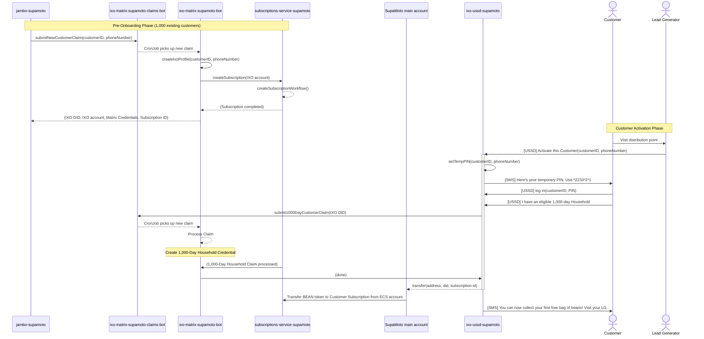
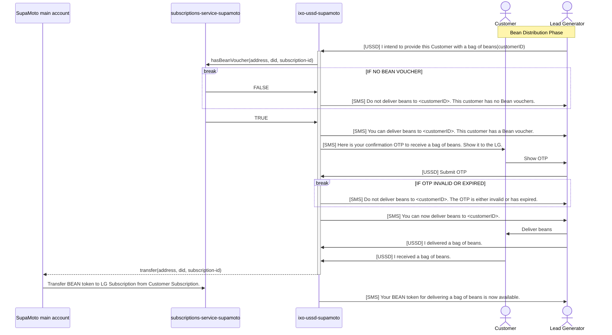
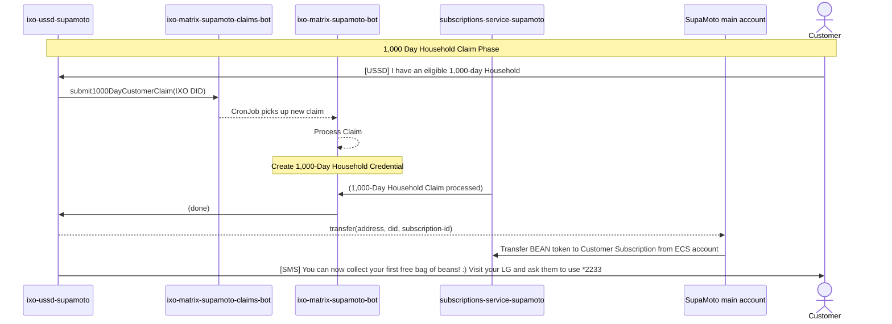
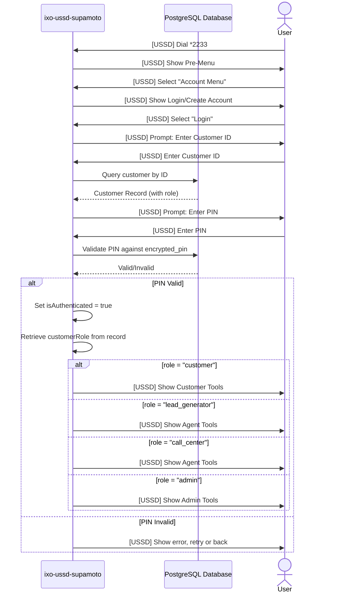

# SupaMoto Sequence Diagrams

This document provides detailed sequence diagrams for the key SupaMoto workflows, including customer activation, bean distribution, and role-based access control.

## 1. Customer Activation Flow

### Overview

Customer activation is a multi-phase process involving pre-onboarding (IXO profile creation), Lead Generator verification at distribution point, and customer self-activation via USSD.

### Sequence Diagram



### Key Steps

1. **Pre-Onboarding**: jambo-supamoto submits customer claims to Matrix bots
2. **IXO Profile Creation**: Matrix bot creates IXO profile and subscription
3. **LG Initiates Activation**: Lead Generator selects "Activate a Customer" from Agent Tools
4. **Temp PIN Generation**: System generates 6-digit temporary PIN
5. **SMS Sent**: Activation SMS sent to customer with temporary PIN
6. **Customer Logs In**: Customer dials USSD and logs in with temp PIN
7. **1,000 Day Household Claim**: Customer declares eligibility
8. **Claim Processing**: Matrix bots process claim and create credential
9. **Token Transfer**: SUPA transfers BEAN token to customer subscription
10. **Confirmation**: Customer receives SMS confirming bean collection eligibility

### Database Operations

- **Insert**: New row in `customers` table
- **Update**: `customers.encrypted_pin` with bcrypt-encrypted PIN
- **Insert**: `household_claims` table with claim data
- **Log**: Event logged in `audit_log` table with type "CUSTOMER_ACTIVATED"

### External Systems Involved

- **jambo-supamoto**: Customer onboarding system
- **ixo-matrix-supamoto-claims-bot**: Claims submission endpoint
- **ixo-matrix-supamoto-bot**: IXO profile and credential creation
- **subscriptions-service-supamoto**: Subscription and voucher management
- **SupaMoto main account (SUPA)**: Token transfer operations

---

## 2. Bean Distribution Workflow

### Overview

Complete bean distribution process from LG intent registration through customer confirmation, including voucher verification and token transfers.

### Sequence Diagram



### Key Steps

1. **Intent Registration**: LG registers intent to deliver beans to customer
2. **Voucher Check**: USSD queries subscriptions-service for bean voucher status
3. **No Voucher Path**: If customer has no voucher, SMS sent to LG with denial
4. **Has Voucher Path**: If customer has voucher, SMS sent to LG confirming delivery eligibility
5. **OTP Generation**: System generates 6-digit OTP (valid 10 minutes) and sends to customer
6. **OTP Display**: Customer shows OTP to LG
7. **OTP Submission**: LG submits OTP via USSD
8. **OTP Validation**: System validates OTP (not expired, not used)
9. **Invalid OTP Path**: If OTP invalid/expired, SMS sent to LG with denial
10. **Valid OTP Path**: If OTP valid, SMS sent to LG confirming delivery authorization
11. **Physical Delivery**: LG delivers beans to customer
12. **LG Confirmation**: LG confirms delivery via USSD
13. **Customer Confirmation**: Customer confirms receipt via USSD
14. **Token Transfer**: SUPA transfers BEAN token from customer to LG subscription
15. **Completion**: LG receives SMS confirming token availability

### Database Operations

- **Insert**: `lg_delivery_intents` (intent registration)
- **Insert**: `bean_distribution_otps` (OTP tracking)
- **Insert**: `bean_delivery_confirmations` (dual confirmations)
- **Update**: `bean_delivery_confirmations` (customer confirmation)
- **Log**: Events in `audit_log` table

### External Systems Involved

- **subscriptions-service-supamoto**: Voucher verification and token transfers
- **SupaMoto main account (SUPA)**: Token transfer operations
- **ixo-ussd-supamoto**: USSD interface and orchestration

### SMS Templates

- **Voucher Check Failure**: "Do not deliver beans to <customerID>. This customer has no Bean vouchers."
- **Voucher Check Success**: "You can deliver beans to <customerID>. This customer has a Bean voucher."
- **OTP SMS to Customer**: "Here is your confirmation OTP to receive a bag of beans. Show it to the LG."
- **OTP Invalid/Expired**: "Do not deliver beans to <customerID>. The OTP is either invalid or has expired."
- **OTP Valid**: "You can now deliver beans to <customerID>."
- **Token Transfer Confirmation**: "Your BEAN token for delivering a bag of beans is now available."

---

## 3. 1,000 Day Household Claim Flow

### Overview

Customer self-proclamation of 1,000 Day Household eligibility for bean voucher allocation, processed through Matrix bots and subscription service.

### Sequence Diagram



### Key Steps

1. **Customer Declares**: Customer selects "1,000 Day Household" and declares eligibility
2. **Claim Submission**: USSD submits claim to ixo-matrix-supamoto-claims-bot
3. **CronJob Processing**: Claims bot triggers cron job in matrix-bot
4. **Claim Processing**: Matrix bot processes claim and creates credential
5. **Subscription Service**: Subscription service confirms claim processing
6. **Credential Creation**: 1,000-Day Household credential created in Matrix
7. **Token Transfer**: USSD initiates transfer to SUPA
8. **BEAN Token Allocation**: SUPA transfers BEAN token to customer subscription from ECS account
9. **Confirmation SMS**: Customer receives SMS confirming bean collection eligibility and LG instructions

### Database Operations

- **Insert**: `household_claims` table with claim data
- **Update**: `household_claims` with claim status and bot response
- **Update**: `customers` with bean voucher allocation flag

### External Systems Involved

- **ixo-matrix-supamoto-claims-bot**: Claims submission endpoint
- **ixo-matrix-supamoto-bot**: Claim processing and credential creation
- **subscriptions-service-supamoto**: Subscription and voucher management
- **SupaMoto main account (SUPA)**: Token transfer operations

### Claim Status Values

- `PENDING`: Claim submitted, awaiting processing
- `APPROVED`: Claim approved, bean voucher allocated, credential created
- `DENIED`: Claim denied, customer ineligible
- `RETRY`: Customer can resubmit claim

### SMS Template

"You can now collect your first free bag of beans! :) Visit your LG and ask them to use *2233#3*2\*2# to register their intent to deliver a bag of beans to you."

---

## 4. Role-Based Access Control Flow

### Overview

System determines user role during login and displays appropriate menu options based on role.

### Sequence Diagram



### Key Steps

1. **Login Initiation**: User selects "Login" from Account Menu
2. **Customer ID Entry**: User enters Customer ID
3. **Database Query**: USSD queries database for customer record
4. **PIN Prompt**: USSD prompts for PIN
5. **PIN Validation**: USSD validates PIN against encrypted_pin in database
6. **Role Retrieval**: On successful validation, customer role is retrieved
7. **Menu Routing**: USSD displays menu based on role
8. **Access Control**: Role-based guards prevent unauthorized access to features

### Role Definitions

- **customer**: Regular customer, can use Customer Tools (1,000 Day Household, Confirm Receipt)
- **lead_generator**: Lead generator, can use Agent Tools (Activate, Register Intent, Submit OTP, Confirm Delivery)
- **call_center**: Call center agent, can use Agent Tools (same as lead_generator)
- **admin**: Administrator, full access to all features

### Database Query

```sql
SELECT customer_id, role, encrypted_pin FROM customers WHERE customer_id = $1
```

### Authentication Flow

1. Customer ID lookup in `customers` table
2. PIN validation using bcrypt comparison
3. Role-based menu routing on successful authentication
4. Session context updated with `customerId`, `customerRole`, and `isAuthenticated` flag

---

## 5. Error Handling & Recovery

### Overview

System error handling and recovery flows.

### Common Error Scenarios

#### Invalid PIN

```
User enters invalid PIN
        |
        v
System shows error message
        |
        v
Retry prompt (up to 3 attempts)
        |
        v
If 3 failures: Lock account, log event
        |
        v
User can go back or exit
```

#### Expired OTP

```
LG submits expired OTP
        |
        v
System validates OTP expiration
        |
        v
OTP expired (> 10 minutes)
        |
        v
Send SMS to LG: "OTP expired, generate new one"
        |
        v
Log event in audit_log
        |
        v
Return to Agent Tools menu
```

#### SMS Delivery Failure

```
System attempts to send SMS
        |
        v
SMS provider returns error
        |
        v
Log event in audit_log with error details
        |
        v
Retry mechanism (configurable)
        |
        v
If all retries fail: Alert admin
```

### Audit Logging

All errors logged in `audit_log` table with:

- `event_type`: Error type (e.g., "INVALID_PIN", "SMS_FAILED")
- `customer_id`: Affected customer
- `details`: Error details (JSON)
- `created_at`: Timestamp

---

## 6. Session Lifecycle

### Overview

Complete USSD session lifecycle from start to end.

### Timeline

```
T0: User dials *2233#
    |
    v
T1: Session initialized
    - sessionId generated
    - phoneNumber captured
    - isAuthenticated = false
    |
    v
T2: Pre-Menu displayed
    |
    v
T3: User navigates menus
    - Multiple INPUT events
    - State transitions
    - Database queries/updates
    |
    v
T4: User selects exit or timeout
    |
    v
T5: Session closed
    - Goodbye message sent
    - Session data cleared
    - Audit log updated
```

### Session Context

- `sessionId`: Unique identifier
- `phoneNumber`: User's phone number
- `serviceCode`: USSD service code
- `customerId`: Customer ID (if authenticated)
- `customerRole`: User role (if authenticated)
- `isAuthenticated`: Boolean flag
- `sessionPin`: Ephemeral PIN for Matrix vault
- `sessionStartTime`: ISO timestamp
- `message`: Current USSD message

### Session Timeout

- Default: 5 minutes (configurable)
- Inactivity triggers automatic session close
- User receives timeout message

---

## Implementation Notes

### State Machine Architecture

- **Parent Machine**: Orchestrates main flows
- **Child Machines**: Handle specific workflows
- **Guards**: Enforce business rules and access control
- **Actions**: Update context and trigger side effects

### Database Transactions

- Critical operations wrapped in transactions
- Rollback on error to maintain consistency
- Audit log updated for all state changes

### SMS Integration

- Asynchronous SMS delivery
- Retry mechanism for failed sends
- Template-based message generation
- Configurable SMS provider

### Performance Considerations

- Database indexes on frequently queried columns
- Connection pooling for database access
- Caching for role-based access control
- Async processing for long-running operations
